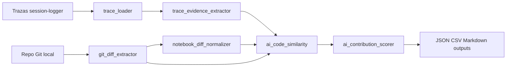
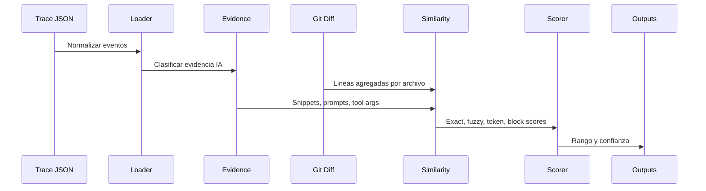
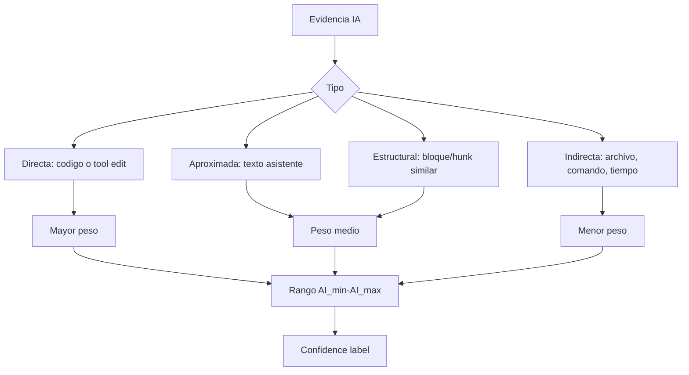
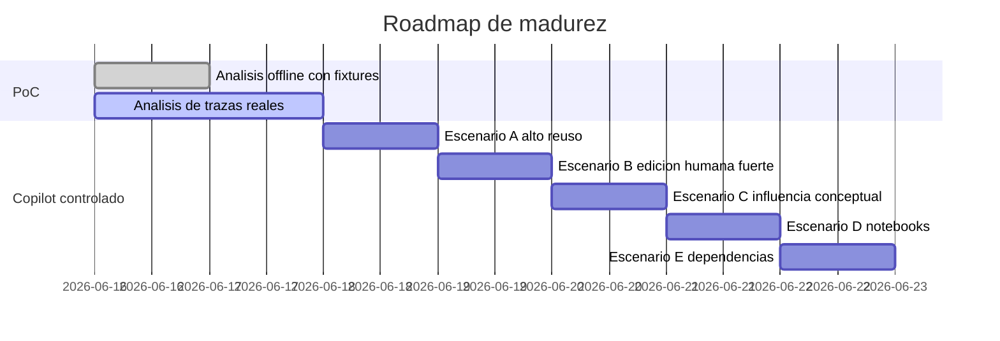
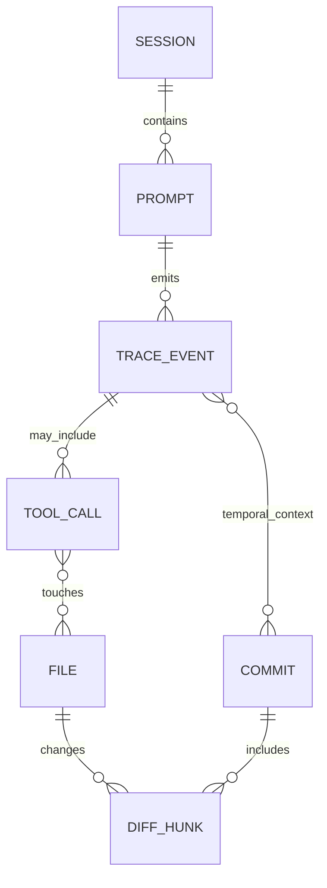
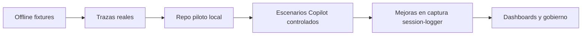

# Propuesta tecnica: deteccion de contribucion IA en codigo final

## 1. Resumen ejecutivo

Se propone una PoC aislada para estimar el rango de contribucion de IA en commits Git usando evidencia observable: trazas de `session-logger`, prompts, respuestas de asistente, tool calls, archivos tocados, comandos, diffs y similitud textual.

La salida no afirma autoria absoluta. Entrega un rango `AI_min-AI_max` y una confianza metodologica por commit, archivo y sesion.

## 2. Problema a resolver

Los equipos necesitan trazabilidad sobre cuanto codigo final pudo estar influenciado por IA. El reto es que las trazas actuales no siempre contienen todo el codigo sugerido, y el codigo final puede ser editado por humanos antes del commit.

## 3. Hipotesis de trabajo

Si una sesion IA contiene prompts de generacion o modificacion, tool calls de edicion, archivos tocados y texto similar al diff final, entonces se puede estimar un rango defendible de contribucion IA.

## 4. Que significa "codigo generado por IA"

Codigo cuya forma final coincide de manera directa o casi directa con texto, bloques, tool arguments o ediciones producidas por el asistente.

## 5. Que significa "codigo editado por humano"

Codigo que conserva una relacion parcial con evidencia IA pero muestra cambios en nombres, estructura, validaciones, orden, estilo o logica hechos antes del commit.

## 6. Que significa "codigo influenciado por IA"

Codigo escrito o confirmado por una persona despues de recibir orientacion conceptual, instrucciones, ejemplos o sugerencias sin coincidencia textual fuerte.

## 7. Datos disponibles en las trazas actuales

- `Trace-2dbae2-2026-06-10 10_28_39.json`: 1 span `user_prompt`, caso control con instruccion de no generar codigo, repo `quantum-computing-experiments`, branch `main`, commit base y sin archivos tocados.
- `Trace-3fff4d-2026-06-10 15_13_18.json`: 12 spans OTLP, Copilot Chat, prompt de regeneracion de `summary_report.py`, tool calls `read_file` y `replace_string_in_file`, ruta del archivo editado y resultado de edicion.

## 8. Datos faltantes o debiles

- No siempre existe el diff exacto aceptado por el usuario.
- Algunas respuestas resumen el resultado en vez de incluir todo el codigo.
- No hay confirmacion nativa de si el humano acepto, edito o descarto cada sugerencia.
- La cercania temporal entre sesion y commit requiere commit timestamps confiables.
- Si Git no esta en `PATH`, solo puede ejecutarse analisis de trazas o dry-run.

## 9. Arquitectura propuesta



## 10. Flujo end-to-end



## 11. Algoritmo de comparacion

1. Normalizar trazas a eventos comunes.
2. Extraer evidencia por tipo.
3. Obtener commits y hunks desde Git.
4. Para notebooks, comparar solo celdas de codigo salvo flag explicito.
5. Comparar evidencia IA contra lineas agregadas.
6. Calcular coincidencias exactas, normalizadas, tokenizadas, fuzzy y por bloque.
7. Estimar rango minimo y maximo.
8. Asignar confianza segun tipo de evidencia y fuerza de similitud.

## 12. Metricas por commit

- Archivos modificados.
- Lineas agregadas y eliminadas.
- Lineas soportadas por la PoC.
- Mejor score de similitud.
- `AI_min`, `AI_max`, `confidence_score`, `confidence_label`.
- Tipos de evidencia usados.

## 13. Metricas por archivo

- Archivo.
- Lineas agregadas y eliminadas.
- Coincidencia exacta.
- Coincidencia normalizada.
- Similitud por tokens.
- Similitud por bloques.
- Rango IA y confianza.

## 14. Metricas por sesion

- Numero de eventos.
- Prompts con solicitud de codigo.
- Respuestas con codigo.
- Tool calls de lectura o edicion.
- Archivos mencionados o tocados.
- Comandos ejecutados.
- Evidencia directa, aproximada, estructural, indirecta o insuficiente.

## 15. Formula de rango minimo y maximo

```text
AI_min = exact_matched_lines / total_added_lines

AI_max = (
  exact_matched_lines * 1.0 +
  fuzzy_matched_lines * 0.75 +
  structural_matched_lines * 0.50 +
  indirect_evidence_lines * 0.25
) / total_added_lines
```

El resultado se limita a `100%` y se reporta como rango.

## 16. Scoring y confianza



Etiquetas:

- `no_evidence`
- `low_ai_evidence`
- `medium_ai_evidence`
- `high_ai_evidence`
- `very_high_ai_evidence`

## 17. Diseno de scripts de la PoC

- `trace_loader.py`: lee trazas simples y OTLP, aplanando eventos a `NormalizedEvent`.
- `trace_evidence_extractor.py`: clasifica evidencia directa, textual, de archivos, comandos, temporal e indirecta.
- `git_diff_extractor.py`: ejecuta Git local y parsea commits, numstat, patch y hunks.
- `notebook_diff_normalizer.py`: extrae celdas `code` e ignora ruido volatil.
- `ai_code_similarity.py`: calcula exact, normalized, token, fuzzy y block similarity.
- `ai_contribution_scorer.py`: calcula rango y confianza.
- `run_experiment.py`: orquesta configuracion, trazas, Git, comparacion, scoring y outputs.

## 18. Diseno de pruebas automatizadas

Las pruebas usan `pytest`, fixtures locales y `--dry-run`. Validan carga tolerante a campos faltantes, OTLP real, evidencia, similitud, formula de scoring, normalizacion de notebooks y salida de archivos.

## 19. Experimentos iniciales con dos trazas

Experimento 1: analizar trazas existentes.

- Contar eventos.
- Identificar prompts.
- Identificar archivos tocados.
- Identificar comandos ejecutados.
- Separar evidencia directa de indirecta.
- Determinar si hay evidencia suficiente para atribucion fuerte.

Experimento 2: comparar contra commits del repo piloto.

- Usar `quantum-computing-experiments`.
- Extraer commits recientes o commit configurado.
- Comparar `.py`, `.ipynb` y `requirements.txt`.
- Calcular rango de contribucion IA.

## 20. Roadmap de pruebas reales con GitHub Copilot



Escenarios:

- A: Copilot genera casi todo, se espera rango alto.
- B: Copilot genera base y humano reescribe, se espera rango medio.
- C: Copilot explica y humano escribe, se espera rango bajo o indirecto.
- D: Copilot genera notebook, se comparan solo celdas de codigo.
- E: Copilot sugiere dependencias, se evalua evidencia directa o indirecta.

## 21. Limitaciones metodologicas

- La similitud textual no prueba autoria.
- Un humano puede copiar codigo IA fuera de una traza.
- Una IA puede influir sin dejar codigo explicito.
- Los notebooks tienen ruido si no se normalizan.
- Un commit puede agrupar trabajo de varias sesiones.

## 22. Falsos positivos y falsos negativos

Falsos positivos:

- Codigo comun o boilerplate parecido a respuestas IA.
- Archivos tocados por herramientas pero no confirmados en commit.
- Dependencias sugeridas por IA pero ya conocidas por el desarrollador.

Falsos negativos:

- Codigo IA reescrito manualmente.
- Respuestas no capturadas completas.
- Commits hechos mucho despues de la sesion.
- Cambios hechos por otro canal de IA no trazado.

## 23. Recomendaciones para mejorar session-logger

- Capturar hashes de contenido antes y despues de tool calls de edicion.
- Guardar diff normalizado de tool calls cuando sea seguro.
- Registrar aceptacion, descarte o edicion manual posterior si el entorno lo permite.
- Enlazar `session_id`, `userPrompt_id`, repo, branch y commit base de forma consistente.
- Registrar timestamps con zona horaria y version del logger.
- Separar evidencia de lectura, escritura, comando y resultado.

## 24. Proximos pasos

1. Ejecutar `pytest tests` desde esta carpeta.
2. Ejecutar `python scripts/run_experiment.py --config config/experiment_config.example.json --dry-run`.
3. Instalar Git o corregir `PATH` si se quiere analizar el repo piloto real.
4. Ejecutar el experimento contra commits recientes de `quantum-computing-experiments`.
5. Realizar los escenarios controlados con Copilot.
6. Comparar resultados esperados contra resultados observados.

## Relacion entre sesion, prompt, traza, archivo, diff y commit



## Modelo de madurez


