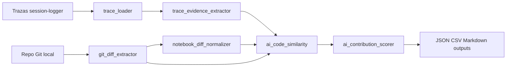
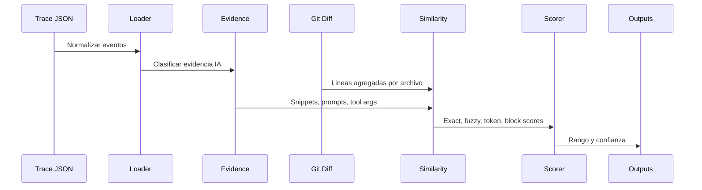
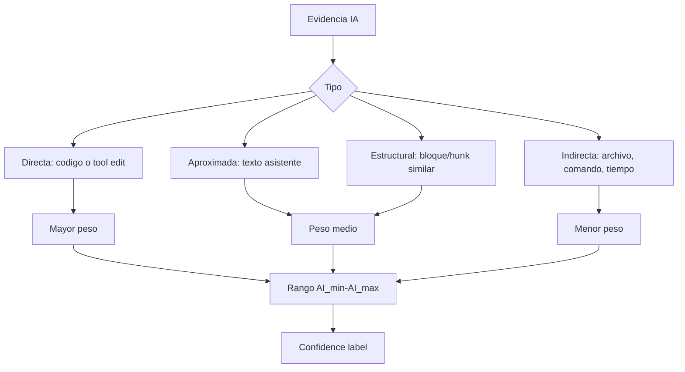
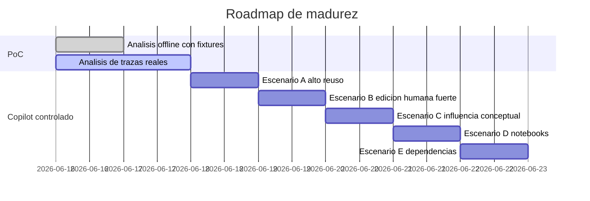
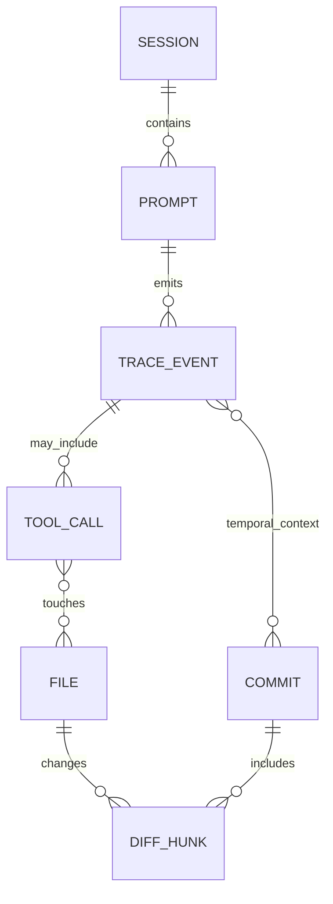
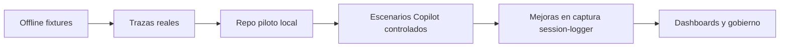

# Propuesta tecnica: deteccion de contribucion IA en codigo final

## 1. Resumen ejecutivo

Se propone una PoC aislada para estimar el rango de contribucion de IA en commits Git usando evidencia observable: trazas de `session-logger`, prompts, respuestas de asistente, tool calls, archivos tocados, comandos, diffs y similitud textual.

La salida no afirma autoria absoluta. Entrega un rango `AI_min-AI_max` y una confianza metodologica por commit, archivo y sesion.

## 2. Problema a resolver

Los equipos necesitan trazabilidad sobre cuanto codigo final pudo estar influenciado por IA. El reto es que las trazas actuales no siempre contienen todo el codigo sugerido, y el codigo final puede ser editado por humanos antes del commit.

## 3. Hipotesis de trabajo

Si una sesion IA contiene prompts de generacion o modificacion, tool calls de edicion, archivos tocados y texto similar al diff final, entonces se puede estimar un rango defendible de contribucion IA.

## 4. Que significa "codigo generado por IA"

Codigo cuya forma final coincide de manera directa o casi directa con texto, bloques, tool arguments o ediciones producidas por el asistente.

## 5. Que significa "codigo editado por humano"

Codigo que conserva una relacion parcial con evidencia IA pero muestra cambios en nombres, estructura, validaciones, orden, estilo o logica hechos antes del commit.

## 6. Que significa "codigo influenciado por IA"

Codigo escrito o confirmado por una persona despues de recibir orientacion conceptual, instrucciones, ejemplos o sugerencias sin coincidencia textual fuerte.

## 7. Datos disponibles en las trazas actuales

- `Trace-2dbae2-2026-06-10 10_28_39.json`: 1 span `user_prompt`, caso control con instruccion de no generar codigo, repo `quantum-computing-experiments`, branch `main`, commit base y sin archivos tocados.
- `Trace-3fff4d-2026-06-10 15_13_18.json`: 12 spans OTLP, Copilot Chat, prompt de regeneracion de `summary_report.py`, tool calls `read_file` y `replace_string_in_file`, ruta del archivo editado y resultado de edicion.

## 8. Datos faltantes o debiles

- No siempre existe el diff exacto aceptado por el usuario.
- Algunas respuestas resumen el resultado en vez de incluir todo el codigo.
- No hay confirmacion nativa de si el humano acepto, edito o descarto cada sugerencia.
- La cercania temporal entre sesion y commit requiere commit timestamps confiables.
- Si Git no esta en `PATH`, solo puede ejecutarse analisis de trazas o dry-run.

## 9. Arquitectura propuesta



## 10. Flujo end-to-end



## 11. Algoritmo de comparacion

1. Normalizar trazas a eventos comunes.
2. Extraer evidencia por tipo.
3. Obtener commits y hunks desde Git.
4. Para notebooks, comparar solo celdas de codigo salvo flag explicito.
5. Comparar evidencia IA contra lineas agregadas.
6. Calcular coincidencias exactas, normalizadas, tokenizadas, fuzzy y por bloque.
7. Estimar rango minimo y maximo.
8. Asignar confianza segun tipo de evidencia y fuerza de similitud.

## 12. Metricas por commit

- Archivos modificados.
- Lineas agregadas y eliminadas.
- Lineas soportadas por la PoC.
- Mejor score de similitud.
- `AI_min`, `AI_max`, `confidence_score`, `confidence_label`.
- Tipos de evidencia usados.

## 13. Metricas por archivo

- Archivo.
- Lineas agregadas y eliminadas.
- Coincidencia exacta.
- Coincidencia normalizada.
- Similitud por tokens.
- Similitud por bloques.
- Rango IA y confianza.

## 14. Metricas por sesion

- Numero de eventos.
- Prompts con solicitud de codigo.
- Respuestas con codigo.
- Tool calls de lectura o edicion.
- Archivos mencionados o tocados.
- Comandos ejecutados.
- Evidencia directa, aproximada, estructural, indirecta o insuficiente.

## 15. Formula de rango minimo y maximo

El scoring parte de una idea conservadora: no intenta decidir si una persona o una IA "es autora" de una linea. Solo estima cuantas lineas agregadas en el diff final tienen evidencia observable de relacion con una interaccion IA capturada.

La unidad base de calculo es:

```text
lineas agregadas soportadas por archivo o commit
```

El pipeline no reparte responsabilidad sobre lineas eliminadas. Las lineas eliminadas se reportan como contexto, pero el porcentaje de contribucion IA se calcula contra lineas agregadas porque son las lineas cuyo contenido final puede compararse contra prompts, respuestas, tool calls o snippets capturados.

### 15.1 Variables de entrada

| Variable | Origen | Significado |
|---|---|---|
| `total_added_lines` | Diff Git parseado | Total de lineas agregadas soportadas para un archivo o commit. |
| `exact_matched_lines` | `ai_code_similarity.py` | Lineas agregadas que coinciden exactamente con lineas de evidencia IA. |
| `fuzzy_matched_lines` | `ai_code_similarity.py` | Lineas agregadas suficientemente parecidas a la evidencia IA segun `similarity_threshold`. |
| `structural_matched_lines` | `ai_code_similarity.py` | Estimacion de lineas estructuralmente similares a partir del score de bloque. |
| `indirect_evidence_lines` | `run_experiment.py` | Lineas agregadas con evidencia indirecta de archivo si la traza referencia el archivo objetivo. |
| `evidence_types` | `trace_evidence_extractor.py` | Tipos de evidencia presentes: directa, textual, archivo, comando, temporal o debil. |
| `weights` | Configuracion del experimento | Pesos aplicados a cada tipo de match. |
| `confidence_ranges` | Configuracion del experimento | Umbrales para etiquetar rangos como `muy_bajo`, `bajo`, `medio`, `alto` o `muy_alto`. |

### 15.2 Normalizacion previa a la comparacion

Antes de calcular similitud, la PoC arma dos textos:

1. Texto de evidencia IA: snippets de respuesta, argumentos de tools, prompts relevantes y otros textos extraidos de la traza.
2. Texto final: lineas agregadas por archivo en el diff del commit.

Luego elimina lineas vacias y calcula varias senales:

| Senal | Como se calcula | Uso en el score final |
|---|---|---|
| `exact_match_score` | Linea agregada exactamente igual a una linea de evidencia. | Si contribuye a `AI_min` y `AI_max`. |
| `normalized_match_score` | Linea igual tras quitar espacios y pasar a minusculas. | Se reporta como metrica, pero actualmente no entra directamente en `AI_max`. |
| `token_similarity_score` | Interseccion/union de tokens entre evidencia y codigo final. | Se reporta como metrica diagnostica. |
| `block_similarity_score` | `SequenceMatcher` sobre bloques normalizados. | Se convierte en `structural_matched_lines`. |
| `best_similarity_score` | Maximo entre exacta, normalizada, token, bloque y fuzzy. | Se reporta para lectura ejecutiva, pero no es por si solo el porcentaje IA. |

Esta separacion es importante: una similitud alta de tokens no significa automaticamente alto `AI_min`. `AI_min` solo sube con coincidencias exactas.

### 15.3 Formula base

```text
AI_min = exact_matched_lines / total_added_lines

AI_max = (
  exact_matched_lines * 1.0 +
  fuzzy_matched_lines * 0.75 +
  structural_matched_lines * 0.50 +
  indirect_evidence_lines * 0.25
) / total_added_lines
```

El resultado se limita a `100%` y se reporta como porcentaje.

### 15.4 Lectura de `AI_min`

`AI_min` es el limite inferior conservador. Solo cuenta lineas exactas:

```text
AI_min_percent = round((exact_matched_lines / total_added_lines) * 100, 2)
```

Si `AI_min` es alto, hay reutilizacion textual fuerte entre evidencia IA capturada y codigo final. Si `AI_min` es bajo, no significa ausencia de IA; puede significar que el humano edito mucho el codigo, que la respuesta IA no se capturo completa o que la influencia fue conceptual.

### 15.5 Lectura de `AI_max`

`AI_max` es el limite superior no estricto. Combina evidencia exacta, fuzzy, estructural e indirecta con pesos:

| Componente | Peso por defecto | Razon |
|---|---:|---|
| `exact_match` | `1.0` | Coincidencia textual fuerte. |
| `fuzzy_match` | `0.75` | Alta similitud con variaciones menores. |
| `structural_match` | `0.50` | Parecido de bloque, patron o estructura. |
| `indirect_evidence` | `0.25` | Archivo, comando o cercania temporal sin contenido exacto. |

Los pesos pueden cambiar por configuracion. Por ejemplo, un experimento de dependencias puede elevar `indirect_evidence` para reconocer que un cambio en `requirements.txt` tiene poca textura de codigo pero mucha evidencia contextual. Ese ajuste aumenta sensibilidad, pero tambien aumenta riesgo de falso positivo.

```text
weighted_lines =
  exact_matched_lines * weight.exact_match +
  fuzzy_matched_lines * weight.fuzzy_match +
  structural_matched_lines * weight.structural_match +
  indirect_evidence_lines * weight.indirect_evidence

AI_max = min(1.0, weighted_lines / total_added_lines)
AI_max_percent = round(AI_max * 100, 2)
```

### 15.6 Como se calcula cada conteo

| Conteo | Detalle operativo |
|---|---|
| `exact_matched_lines` | Cada linea agregada se compara contra el set de lineas de evidencia. Si existe igual, cuenta como exacta. |
| `fuzzy_matched_lines` | Si la linea no tuvo match normalizado, se busca su mejor ratio con `SequenceMatcher`; cuenta si supera `similarity_threshold`, por defecto `0.72`. |
| `structural_matched_lines` | Se calcula `block_similarity_score * total_added_lines` y se redondea a entero. |
| `indirect_evidence_lines` | En el flujo actual, si existe evidencia asociada al archivo, puede contar hasta todas las lineas agregadas de ese archivo como cubiertas por evidencia indirecta. |

La evidencia indirecta debe interpretarse con cautela: indica que el archivo estuvo dentro de la sesion IA, no que cada linea haya sido generada por IA.

### 15.7 Caso sin lineas agregadas

Si `total_added_lines <= 0`, el scorer devuelve:

```text
AI_min = 0.0
AI_max = 0.0
confidence_score = 0.0
confidence_label = no_evidence
confidence_range_label = sin_evidencia
```

Esto evita porcentajes artificiales cuando solo hay eliminaciones, renombres, cambios no soportados o un diff vacio.

## 16. Scoring y confianza

La confianza se calcula separada del porcentaje IA. Esta distincion es central:

- `AI_min` y `AI_max` responden: "que proporcion del diff tiene evidencia de relacion con IA?"
- `confidence_score` responde: "que tan buena es la evidencia disponible para sostener esa estimacion?"
- `confidence_label` resume intensidad de evidencia segun el valor de `AI_max`.
- `confidence_range_label` cruza porcentaje y confianza contra umbrales configurables.



### 16.1 Tipos de evidencia usados para confianza

La PoC reduce los tipos de evidencia a un conjunto unico por archivo o commit. Es decir, para confianza importa que un tipo exista, no cuantas veces aparecio. Esto evita que una traza ruidosa infle la confianza solo por repetir eventos similares.

| Tipo | Peso de confianza | Lectura |
|---|---:|---|
| `direct_code_evidence` | `0.40` | Respuesta o tool call contiene codigo comparable. |
| `assistant_text_evidence` | `0.20` | Prompt o texto del asistente pide o describe generacion/modificacion. |
| `file_touch_evidence` | `0.15` | La traza referencia o edita el archivo objetivo. |
| `command_evidence` | `0.08` | La sesion ejecuta comandos relevantes. |
| `temporal_evidence` | `0.07` | Hay timestamp util para proximidad temporal. |
| `weak_indirect_evidence` | `0.04` | Interaccion IA debil, conceptual o sin generacion clara. |

### 16.2 Formula de `confidence_score`

```text
type_score = suma de pesos por cada tipo de evidencia unico

volume_score = min(0.15, total_added_lines / 200)

similarity_score = min(0.30, AI_max * 0.30)

confidence_score = min(1.0, type_score + volume_score + similarity_score)
```

Donde `AI_max` se usa como fraccion entre `0.0` y `1.0`, no como porcentaje. Por ejemplo, `AI_max = 40%` entra como `0.40`.

### 16.3 Lectura de cada componente de confianza

| Componente | Que mide | Por que existe | Riesgo |
|---|---|---|---|
| `type_score` | Diversidad y fuerza de tipos de evidencia. | Una respuesta con codigo y tool call es mas defendible que solo una marca temporal. | Puede saturar si hay muchos tipos pero mala asociacion a commit. |
| `volume_score` | Volumen de lineas agregadas. | Un diff con mas lineas da mas superficie para comparar. | No implica autoria; solo mejora estabilidad estadistica. |
| `similarity_score` | Fuerza del rango `AI_max`. | Si la evidencia cubre mas lineas, la estimacion es mas consistente. | Puede subir por evidencia indirecta si el peso esta alto. |

### 16.4 Etiqueta `confidence_label`

`confidence_label` se asigna principalmente por `AI_max`. La confianza numerica solo bloquea el caso sin evidencia.

```text
if no hay evidencia o confidence_score == 0:
    confidence_label = no_evidence
elif AI_max < 0.20:
    confidence_label = low_ai_evidence
elif AI_max < 0.50:
    confidence_label = medium_ai_evidence
elif AI_max < 0.80:
    confidence_label = high_ai_evidence
else:
    confidence_label = very_high_ai_evidence
```

Etiquetas disponibles:

- `no_evidence`
- `low_ai_evidence`
- `medium_ai_evidence`
- `high_ai_evidence`
- `very_high_ai_evidence`

Interpretacion:

| Etiqueta | Lectura |
|---|---|
| `no_evidence` | No hay lineas agregadas comparables o no hay evidencia util. |
| `low_ai_evidence` | Hay poca cobertura estimada o evidencia principalmente indirecta. |
| `medium_ai_evidence` | Hay evidencia parcial; compatible con edicion humana o similitud moderada. |
| `high_ai_evidence` | Hay cobertura alta o combinacion fuerte de evidencia directa/indirecta. |
| `very_high_ai_evidence` | Hay cobertura muy alta con evidencia capturada; no equivale a autoria absoluta. |

### 16.5 Etiqueta `confidence_range_label`

Ademas de `confidence_label`, la PoC calcula `confidence_range_label` con umbrales configurables. El mapeo exige dos condiciones al mismo tiempo:

```text
AI_max_percent >= min_ai_percent
confidence_score >= min_confidence_score
```

Rangos por defecto:

| Rango | `min_ai_percent` | `min_confidence_score` |
|---|---:|---:|
| `muy_bajo` | `0.0` | `0.0` |
| `bajo` | `20.0` | `0.40` |
| `medio` | `40.0` | `0.55` |
| `alto` | `60.0` | `0.70` |
| `muy_alto` | `80.0` | `0.85` |

El algoritmo ordena los rangos de mayor a menor y retorna el primero que cumpla ambas condiciones. Si ninguno cumple, retorna `por_debajo_del_umbral`.

### 16.6 Ejemplo numerico

Supongamos un archivo con 20 lineas agregadas:

```text
total_added_lines = 20
exact_matched_lines = 1
fuzzy_matched_lines = 5
structural_matched_lines = 4
indirect_evidence_lines = 20

pesos:
exact_match = 1.0
fuzzy_match = 0.75
structural_match = 0.50
indirect_evidence = 0.25
```

Calculo:

```text
AI_min = 1 / 20 = 0.05 = 5.0%

weighted_lines =
  1 * 1.0 +
  5 * 0.75 +
  4 * 0.50 +
  20 * 0.25

weighted_lines = 1 + 3.75 + 2 + 5 = 11.75

AI_max = 11.75 / 20 = 0.5875 = 58.75%
```

Lectura: existe poca reutilizacion exacta (`AI_min = 5.0%`), pero el rango ampliado sugiere influencia observable mayor (`AI_max = 58.75%`) por similitud fuzzy, estructura e indicios de archivo.

### 16.7 Ejemplo de confianza

Para el mismo archivo, si existen estos tipos de evidencia:

```text
direct_code_evidence
assistant_text_evidence
file_touch_evidence
temporal_evidence
```

Entonces:

```text
type_score = 0.40 + 0.20 + 0.15 + 0.07 = 0.82
volume_score = min(0.15, 20 / 200) = 0.10
similarity_score = min(0.30, 0.5875 * 0.30) = 0.17625

confidence_score = min(1.0, 0.82 + 0.10 + 0.17625)
confidence_score = 1.0
```

Este `confidence_score = 1.0` no significa certeza de autoria IA. Significa que, bajo el modelo actual, hay suficiente diversidad de evidencia, volumen y cobertura para considerar defendible la estimacion. La conclusion correcta seria: "existe evidencia observable fuerte de contribucion o influencia IA", no "la IA escribio el codigo".

### 16.8 Diferencia entre score de similitud y porcentaje IA

`best_similarity_score` y `AI_max` no son equivalentes:

| Campo | Que representa | Ejemplo de uso |
|---|---|---|
| `best_similarity_score` | Mejor similitud textual/estructural observada entre evidencia y codigo final. | Diagnosticar que tan parecido es el texto. |
| `AI_min` | Porcentaje minimo por coincidencia exacta. | Medir reutilizacion fuerte. |
| `AI_max` | Porcentaje maximo ponderado por evidencia exacta, fuzzy, estructural e indirecta. | Estimar contribucion o influencia no estricta. |
| `confidence_score` | Calidad metodologica de la evidencia. | Evaluar si el rango es defendible. |

Un archivo puede tener `best_similarity_score` bajo y `AI_max` medio si hay mucha evidencia indirecta ponderada. Ese caso debe reportarse con cautela.

### 16.9 Reglas de interpretacion ejecutiva

| Patron observado | Lectura recomendada |
|---|---|
| `AI_min` alto y `AI_max` alto | Alta coincidencia observable con evidencia IA capturada. |
| `AI_min` bajo y `AI_max` medio/alto | Posible influencia IA con edicion humana, o alta dependencia de evidencia indirecta. |
| `AI_min = 0` y `AI_max = 0` | No hay evidencia comparable suficiente contra el diff. |
| `confidence_score` alto con `AI_max` bajo | La traza es rica, pero no hay similitud o cobertura suficiente. |
| `confidence_score` bajo con `AI_max` alto | El porcentaje puede estar soportado por evidencia fragil; requiere revision manual. |
| Peso indirecto elevado | Mayor sensibilidad para configuracion/dependencias, mayor riesgo de falso positivo. |

### 16.10 Salvaguardas metodologicas

- No declarar autoria absoluta.
- Reportar siempre `AI_min` y `AI_max`, no un unico porcentaje.
- Mostrar `evidence_types` junto al score.
- Separar evidencia directa de evidencia indirecta.
- Documentar pesos usados por escenario.
- Revisar manualmente casos con `AI_min = 0` y `AI_max` medio/alto.
- Para notebooks, comparar solo celdas de codigo y excluir metadata, outputs y `execution_count`.
- Para dependencias, exigir evidencia textual de la sugerencia o aceptacion antes de interpretar un rango alto.

## 17. Diseno de scripts de la PoC

- `trace_loader.py`: lee trazas simples y OTLP, aplanando eventos a `NormalizedEvent`.
- `trace_evidence_extractor.py`: clasifica evidencia directa, textual, de archivos, comandos, temporal e indirecta.
- `git_diff_extractor.py`: ejecuta Git local y parsea commits, numstat, patch y hunks.
- `notebook_diff_normalizer.py`: extrae celdas `code` e ignora ruido volatil.
- `ai_code_similarity.py`: calcula exact, normalized, token, fuzzy y block similarity.
- `ai_contribution_scorer.py`: calcula rango y confianza.
- `run_experiment.py`: orquesta configuracion, trazas, Git, comparacion, scoring y outputs.

## 18. Diseno de pruebas automatizadas

Las pruebas usan `pytest`, fixtures locales y `--dry-run`. Validan carga tolerante a campos faltantes, OTLP real, evidencia, similitud, formula de scoring, normalizacion de notebooks y salida de archivos.

## 19. Experimentos iniciales con dos trazas

Experimento 1: analizar trazas existentes.

- Contar eventos.
- Identificar prompts.
- Identificar archivos tocados.
- Identificar comandos ejecutados.
- Separar evidencia directa de indirecta.
- Determinar si hay evidencia suficiente para atribucion fuerte.

Experimento 2: comparar contra commits del repo piloto.

- Usar `quantum-computing-experiments`.
- Extraer commits recientes o commit configurado.
- Comparar `.py`, `.ipynb` y `requirements.txt`.
- Calcular rango de contribucion IA.

## 20. Roadmap de pruebas reales con GitHub Copilot



Escenarios:

- A: Copilot genera casi todo, se espera rango alto.
- B: Copilot genera base y humano reescribe, se espera rango medio.
- C: Copilot explica y humano escribe, se espera rango bajo o indirecto.
- D: Copilot genera notebook, se comparan solo celdas de codigo.
- E: Copilot sugiere dependencias, se evalua evidencia directa o indirecta.

## 21. Limitaciones metodologicas

- La similitud textual no prueba autoria.
- Un humano puede copiar codigo IA fuera de una traza.
- Una IA puede influir sin dejar codigo explicito.
- Los notebooks tienen ruido si no se normalizan.
- Un commit puede agrupar trabajo de varias sesiones.

## 22. Falsos positivos y falsos negativos

Falsos positivos:

- Codigo comun o boilerplate parecido a respuestas IA.
- Archivos tocados por herramientas pero no confirmados en commit.
- Dependencias sugeridas por IA pero ya conocidas por el desarrollador.

Falsos negativos:

- Codigo IA reescrito manualmente.
- Respuestas no capturadas completas.
- Commits hechos mucho despues de la sesion.
- Cambios hechos por otro canal de IA no trazado.

## 23. Recomendaciones para mejorar session-logger

- Capturar hashes de contenido antes y despues de tool calls de edicion.
- Guardar diff normalizado de tool calls cuando sea seguro.
- Registrar aceptacion, descarte o edicion manual posterior si el entorno lo permite.
- Enlazar `session_id`, `userPrompt_id`, repo, branch y commit base de forma consistente.
- Registrar timestamps con zona horaria y version del logger.
- Separar evidencia de lectura, escritura, comando y resultado.

## 24. Proximos pasos

1. Ejecutar `pytest tests` desde esta carpeta.
2. Ejecutar `python scripts/run_experiment.py --config config/experiment_config.example.json --dry-run`.
3. Instalar Git o corregir `PATH` si se quiere analizar el repo piloto real.
4. Ejecutar el experimento contra commits recientes de `quantum-computing-experiments`.
5. Realizar los escenarios controlados con Copilot.
6. Comparar resultados esperados contra resultados observados.

## Relacion entre sesion, prompt, traza, archivo, diff y commit



## Modelo de madurez


