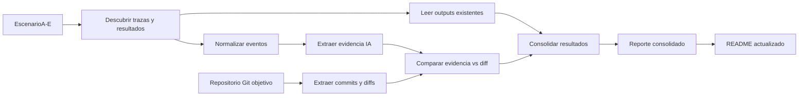

# Resultados consolidados de experimentos - Deteccion de contribucion de codigo IA

Fecha de consolidacion: 2026-06-18  
Repositorio local observado: `Estrategia-e-innovacion-de-TI/session-logger`  
Rama observada en `.git/HEAD`: `development`  
Carpeta analizada: `propuesta-deteccion-codigo-ia/`

Este reporte consolida evidencia ya existente en las carpetas `EscenarioA/` a `EscenarioE/`, sus configuraciones y sus salidas en `outputs/`. No modifica ni reinterpreta metricas faltantes como si fueran resultados; cuando una lectura depende de evidencia indirecta o de una limitacion metodologica, se marca explicitamente.

## 1. Resumen ejecutivo

Se analizaron cinco escenarios experimentales para estimar la proporcion de codigo final de commits que tiene evidencia observable de haber sido generado, sugerido, editado o influenciado por IA. La PoC usa trazas de `session-logger`, evidencia de prompts, respuestas, tool calls, archivos tocados, comandos, diffs Git y metricas de similitud para producir rangos `AI_min` y `AI_max`.

Los cinco escenarios tienen trazas, configuracion, salidas JSON/CSV/Markdown y un commit evaluado. En terminos de ejecucion, todos produjeron resultados. En terminos de interpretacion, los escenarios D y E requieren cautela adicional: D evalua un notebook y la salida no deja totalmente verificable que metadata/outputs hayan sido excluidos del score ya generado; E pondera mas fuerte la evidencia indirecta (`indirect_evidence = 0.55`), por lo que su `AI_max` no debe leerse igual que una coincidencia textual directa.

El escenario con mayor evidencia estimada fue A, con `AI_min = 32.56%` y `AI_max = 75.87%` sobre `summary_report.py`. El escenario con menor evidencia fue C, con `AI_min = 0.0%` y `AI_max = 0.0%` sobre `scenario_c_manual.py`, consistente con un caso de consulta conceptual y escritura manual.

La metodologia es viable como primera estimacion defendible, no como atribucion forense absoluta. La calidad de la atribucion depende de que la traza capture contenido de respuesta, tool calls de edicion, archivos objetivo y una asociacion confiable entre sesion y commit.

## 2. Contexto

La PoC busca estimar que proporcion del codigo final de un commit puede estar asociada a codigo generado, sugerido o influenciado por IA usando evidencia observable de `session-logger`. La evidencia se correlaciona con diffs Git y metricas de similitud textual o estructural.

El objetivo no es demostrar autoria absoluta. El resultado es un rango de contribucion estimada, con una confianza metodologica dependiente de la calidad de las trazas, la disponibilidad del diff y el tipo de evidencia capturada.

## 3. Objetivo de la evaluacion

La evaluacion busca validar si las trazas permiten correlacionar este flujo:

```text
prompt -> respuesta IA -> herramienta/editor -> archivo modificado -> diff Git -> commit final
```

Tambien valida si los scores por commit, archivo y escenario producen rangos interpretables para gobierno tecnico, observabilidad de uso de IA y experimentos controlados con GitHub Copilot.

## 4. Alcance

Incluye:

- Analisis de `EscenarioA/`, `EscenarioB/`, `EscenarioC/`, `EscenarioD/` y `EscenarioE/`.
- Lectura de trazas por escenario y dos trazas historicas en la raiz de la PoC.
- Lectura de `config/experimentA_config.json` a `config/experimentE_config.json`.
- Lectura de outputs existentes por escenario: resumen JSON, CSV por commit, CSV por archivo y reporte Markdown.
- Comparacion contra commits ya presentes en los outputs.
- Interpretacion de `AI_min`, `AI_max`, confianza y evidencia dominante.
- Actualizacion del README de la carpeta de la PoC.

Excluye:

- Atribucion absoluta de autoria.
- Analisis de codigo que no este presente en trazas, commits o outputs.
- Modificaciones del backend, hooks o arquitectura base de `session-logger`.
- Cambios fuera de `propuesta-deteccion-codigo-ia/`.
- Recalculo de resultados con Git local desde esta sesion, porque `git` no esta disponible en el PATH de este entorno.

## 5. Organizacion de los escenarios

| Escenario | Hipotesis experimental | Resultado esperado | Lectura real encontrada |
|---|---|---|---|
| Escenario A | Codigo casi completamente generado o aceptado desde IA | Rango IA alto | Resultado alto: `AI_max = 75.87%` sobre `summary_report.py`. |
| Escenario B | Codigo generado por IA con edicion humana fuerte | Rango IA medio | Resultado medio: `AI_max = 40.0%` sobre `scenario_b_semilla.py`. |
| Escenario C | Consulta conceptual a IA, codigo escrito principalmente por humano | Rango IA bajo o evidencia indirecta | Resultado muy bajo: `AI_max = 0.0%` y sin `direct_code_evidence`. |
| Escenario D | Notebook o analisis asistido por IA | Score basado idealmente en celdas de codigo | Resultado medio: `AI_max = 40.46%`; requiere cautela por notebook. |
| Escenario E | Cambios de dependencias, configuracion o ajustes auxiliares | Evidencia variable, posiblemente indirecta | Resultado medio: `AI_max = 55.0%`; dominado por evidencia indirecta y configuracion de peso mayor. |

## 6. Insumos analizados

| Insumo | Tipo | Escenario | Estado | Observaciones |
|---|---|---|---|---|
| `EscenarioA/` | Carpeta de escenario | A | Analizada | 13 trazas, 113 eventos, 1 commit evaluado. |
| `EscenarioB/` | Carpeta de escenario | B | Analizada | 17 trazas, 32 eventos, 1 commit evaluado. |
| `EscenarioC/` | Carpeta de escenario | C | Analizada | 6 trazas, 8 eventos, 1 commit evaluado. |
| `EscenarioD/` | Carpeta de escenario | D | Analizada con cautela | 21 trazas, 41 eventos, notebook evaluado. |
| `EscenarioE/` | Carpeta de escenario | E | Analizada con cautela | 16 trazas, 43 eventos, dependencia/configuracion evaluada. |
| `config/` | Configuraciones | General | Encontrado | Config por escenario: `experimentA_config.json` a `experimentE_config.json`. |
| `outputs/` | Salidas globales por escenario | General | Encontrado | Cada escenario tiene JSON, CSV por commit, CSV por archivo y reporte Markdown. |
| `scripts/` | Pipeline PoC | General | Encontrado | Loader, extractor, similitud, scoring, Git diff, normalizador notebook y runner. |
| `tests/` | Pruebas | General | Encontrado | Pruebas unitarias y fixture de dry-run. |
| `README.md` | Documentacion | General | Actualizado | Se reorganizo por escenarios y enlaza este consolidado. |
| `Trace-2dbae2-2026-06-10 10_28_39.json` | Traza raiz | Control historico | Analizada como contexto | 1 evento, prompt conceptual/no codigo, rama `main`. |
| `Trace-3fff4d-2026-06-10 15_13_18.json` | Traza raiz | Control historico | Analizada como contexto | 12 eventos, edicion de `summary_report.py`, evidencia directa e indirecta. |

## 7. Metodologia aplicada

Flujo usado para consolidar resultados:

1. Descubrimiento de carpetas de escenario.
2. Lectura de configuraciones `experimentA_config.json` a `experimentE_config.json`.
3. Carga de trazas con el normalizador de la PoC.
4. Extraccion de evidencia IA con `trace_evidence_extractor.py`.
5. Lectura de resultados existentes en `outputs/EscenarioX/`.
6. Lectura de commits y archivos evaluados desde los CSV ya generados.
7. Validacion de parametros relevantes: inclusion de notebooks, outputs de notebook excluidos en config y pesos de scoring.
8. Consolidacion de metricas por escenario, commit, archivo y traza.
9. Identificacion de limitaciones y riesgos metodologicos.
10. Actualizacion documental.



## 8. Resultados consolidados

| Metrica | Valor | Observacion |
|---|---:|---|
| Escenarios analizados | 5 | A, B, C, D y E. |
| Escenarios con outputs completos | 5 | Cada escenario tiene resumen JSON, CSV por commit, CSV por archivo y reporte Markdown. |
| Escenarios con interpretacion parcial | 2 | D por notebook; E por dependencia de evidencia indirecta. |
| Trazas procesadas en escenarios | 73 | No incluye las 2 trazas historicas de la raiz. |
| Eventos normalizados | 237 | Suma de eventos normalizados por escenario. |
| Prompts detectados | 42 | Eventos con `prompt_text`. |
| Respuestas IA detectadas | 66 | Eventos con `assistant_response`. |
| Evidencias procesadas | 478 | Suma de evidencias clasificadas por tipo. |
| Archivos tocados unicos en trazas | 39 | Incluye ruido de rutas/listas capturadas en algunas trazas. |
| Comandos unicos detectados | 11 | Incluye comandos de hooks y comandos Git/Python del experimento. |
| Commits evaluados | 5 | Un commit por escenario. |
| Archivos evaluados | 5 | Un archivo principal por escenario. |
| Lineas agregadas evaluadas | 283 | Todas soportadas por el pipeline reportado. |
| Lineas eliminadas evaluadas | 7 | Solo Escenario E reporta eliminaciones. |
| AI min promedio simple | 8.04% | Promedio no ponderado por commit. |
| AI max promedio simple | 42.27% | Promedio no ponderado por commit. |
| AI min ponderado por lineas | 11.66% | Ponderado por lineas soportadas. |
| AI max ponderado por lineas | 48.97% | Ponderado por lineas soportadas. |
| Confianza predominante | `high_ai_evidence` y `medium_ai_evidence` | 2 escenarios high, 2 medium, 1 low. |
| Rango predominante | `medio` | 3 escenarios en rango medio, 1 alto, 1 muy bajo. |

Evidencia agregada por tipo:

| Tipo de evidencia | Total |
|---|---:|
| `temporal_evidence` | 179 |
| `command_evidence` | 118 |
| `file_touch_evidence` | 92 |
| `direct_code_evidence` | 47 |
| `assistant_text_evidence` | 26 |
| `weak_indirect_evidence` | 16 |

## 9. Resultados por escenario

### 9.1 Escenario A

#### Objetivo del escenario

Validar un caso de alta reutilizacion o aceptacion de codigo sugerido por IA, usando una funcion agregada en `summary_report.py`.

#### Archivos encontrados

- 13 trazas en `EscenarioA/`.
- Configuracion `config/experimentA_config.json`.
- Outputs en `outputs/EscenarioA/`.
- Documento historico `EXPERIMENTO_ESCENARIO_A.md`.

#### Trazas analizadas

`Trace-12e51b-2026-06-18 09_10_45.json`, `Trace-1863b0-2026-06-18 09_10_54.json`, `Trace-224b1e-2026-06-18 09_10_16.json`, `Trace-271e1a-2026-06-18 09_10_19.json`, `Trace-2cb635-2026-06-18 09_10_50.json`, `Trace-40f3d2-2026-06-18 09_10_10.json`, `Trace-7d3801-2026-06-18 09_10_23.json`, `Trace-8a4f4a-2026-06-18 09_10_48.json`, `Trace-9196da-2026-06-18 09_10_41.json`, `Trace-b59818-2026-06-18 09_10_07.json`, `Trace-bef58a-2026-06-18 09_11_00.json`, `Trace-c30b9a-2026-06-18 09_10_56.json`, `Trace-d8fc67-2026-06-18 09_10_02.json`.

#### Resultados disponibles

| Elemento | Resultado |
|---|---|
| Estado del escenario | Completo |
| Trazas analizadas | 13 |
| Eventos normalizados | 113 |
| Prompts detectados | 19 |
| Respuestas IA detectadas | 32 |
| Outputs encontrados | JSON, CSV por commit, CSV por archivo, reporte Markdown |
| Commits evaluados | 1 |
| Archivos evaluados | 1 |
| AI min | 32.56% |
| AI max | 75.87% |
| Confianza | `high_ai_evidence`, rango `alto` |
| Evidencia dominante | Directa, aproximada e indirecta |
| Conclusion | Escenario con mayor evidencia estimada de contribucion IA. |

#### Evidencia IA encontrada

Se encontraron 242 items de evidencia: 21 `direct_code_evidence`, 10 `assistant_text_evidence`, 46 `file_touch_evidence`, 68 `command_evidence`, 88 `temporal_evidence` y 9 `weak_indirect_evidence`.

#### Commits o archivos evaluados

- Commit: `c876d697b3e44f6b048120296a582dbb06d2b40f`.
- Fecha: `2026-06-18T09:08:56-05:00`.
- Archivo: `summary_report.py`.
- Lineas agregadas: 86.

#### Metricas calculadas

`best_similarity_score = 0.5263`, `AI_min = 32.56%`, `AI_max = 75.87%`, `confidence_score = 1.0`.

#### Interpretacion

El rango sugiere participacion alta de evidencia IA observable, especialmente por la combinacion de evidencia directa, prompts, tool calls, archivos tocados y comandos. No prueba autoria absoluta de la funcion.

#### Limitaciones del escenario

Las trazas incluyen commits Git en metadata que no coinciden de forma directa con el commit evaluado en el output, por lo que la asociacion `session_id -> commit_hash` aun debe fortalecerse.

#### Conclusion del escenario

Escenario A valida la hipotesis de rango alto y es el caso mas robusto para demostrar la utilidad de la PoC.

### 9.2 Escenario B

#### Objetivo del escenario

Validar un caso de codigo con base sugerida por IA y edicion humana fuerte.

#### Archivos encontrados

- 17 trazas en `EscenarioB/`.
- Configuracion `config/experimentB_config.json`.
- Outputs en `outputs/EscenarioB/`.

#### Trazas analizadas

`Trace-065e96-2026-06-18 10_48_28.json`, `Trace-065e96-2026-06-18 10_48_33.json`, `Trace-3029dd-2026-06-18 10_48_14.json`, `Trace-3c0c2b-2026-06-18 10_49_05.json`, `Trace-524f25-2026-06-18 10_48_58.json`, `Trace-614938-2026-06-18 10_48_26.json`, `Trace-79ce32-2026-06-18 10_49_08.json`, `Trace-905cff-2026-06-18 10_48_49.json`, `Trace-90e4d5-2026-06-18 10_48_23.json`, `Trace-90e4d5-2026-06-18 10_48_24.json`, `Trace-b2a05c-2026-06-18 10_48_20.json`, `Trace-b6a793-2026-06-18 10_49_03.json`, `Trace-bdd877-2026-06-18 10_48_51.json`, `Trace-c516d8-2026-06-18 10_48_45.json`, `Trace-c8f644-2026-06-18 10_49_00.json`, `Trace-ce5ce7-2026-06-18 10_48_53.json`, `Trace-ce62f2-2026-06-18 10_48_55.json`.

#### Resultados disponibles

| Elemento | Resultado |
|---|---|
| Estado del escenario | Completo |
| Trazas analizadas | 17 |
| Eventos normalizados | 32 |
| Prompts detectados | 7 |
| Respuestas IA detectadas | 8 |
| Outputs encontrados | JSON, CSV por commit, CSV por archivo, reporte Markdown |
| Commits evaluados | 1 |
| Archivos evaluados | 1 |
| AI min | 5.0% |
| AI max | 40.0% |
| Confianza | `medium_ai_evidence`, rango `medio` |
| Evidencia dominante | Aproximada, directa parcial e indirecta |
| Conclusion | Consistente con base IA y reescritura humana. |

#### Evidencia IA encontrada

Se encontraron 67 items de evidencia: 11 `direct_code_evidence`, 6 `assistant_text_evidence`, 14 `file_touch_evidence`, 10 `command_evidence`, 25 `temporal_evidence` y 1 `weak_indirect_evidence`.

#### Commits o archivos evaluados

- Commit: `ae852581f77044a7931b6ed5df0818bd0a70aa9b`.
- Fecha: `2026-06-18T10:53:41-05:00`.
- Archivo: `scenario_b_semilla.py`.
- Lineas agregadas: 20.

#### Metricas calculadas

`best_similarity_score = 0.4545`, `AI_min = 5.0%`, `AI_max = 40.0%`, `confidence_score = 1.0`.

#### Interpretacion

El `AI_min` bajo y el `AI_max` medio sugieren que existe evidencia observable de influencia IA, pero con baja reutilizacion exacta. Esta lectura es consistente con edicion humana fuerte.

#### Limitaciones del escenario

Varias trazas mencionan archivos de escenarios previos, scripts u outputs de la PoC. Esto introduce ruido de contexto y exige filtrar con mas precision el archivo objetivo.

#### Conclusion del escenario

Escenario B valida una zona intermedia: hay evidencia de IA, pero la similitud exacta es limitada y la interpretacion depende del rango ampliado.

### 9.3 Escenario C

#### Objetivo del escenario

Validar un caso de consulta conceptual a IA donde el codigo final fue escrito principalmente por una persona.

#### Archivos encontrados

- 6 trazas en `EscenarioC/`.
- Configuracion `config/experimentC_config.json`.
- Outputs en `outputs/EscenarioC/`.

#### Trazas analizadas

`Trace-0ae89f-2026-06-18 11_15_34.json`, `Trace-32146b-2026-06-18 11_15_43.json`, `Trace-aff59a-2026-06-18 11_15_37.json`, `Trace-b8723b-2026-06-18 11_15_41.json`, `Trace-e886ac-2026-06-18 11_15_39.json`, `Trace-fd0745-2026-06-18 11_15_45.json`.

#### Resultados disponibles

| Elemento | Resultado |
|---|---|
| Estado del escenario | Completo, no concluyente para contribucion directa IA |
| Trazas analizadas | 6 |
| Eventos normalizados | 8 |
| Prompts detectados | 5 |
| Respuestas IA detectadas | 4 |
| Outputs encontrados | JSON, CSV por commit, CSV por archivo, reporte Markdown |
| Commits evaluados | 1 |
| Archivos evaluados | 1 |
| AI min | 0.0% |
| AI max | 0.0% |
| Confianza | `low_ai_evidence`, rango `muy_bajo` |
| Evidencia dominante | Indirecta o insuficiente |
| Conclusion | No se encontro evidencia textual suficiente para atribuir contribucion IA al codigo final. |

#### Evidencia IA encontrada

Se encontraron 13 items de evidencia: 4 `assistant_text_evidence`, 1 `file_touch_evidence`, 2 `command_evidence`, 5 `temporal_evidence` y 1 `weak_indirect_evidence`. No se encontro `direct_code_evidence`.

#### Commits o archivos evaluados

- Commit: `efac6efc528b847f3efbf51157cd1b5bb612366c`.
- Fecha: `2026-06-18T11:15:11-05:00`.
- Archivo: `scenario_c_manual.py`.
- Lineas agregadas: 18.

#### Metricas calculadas

`best_similarity_score = 0.0528`, `AI_min = 0.0%`, `AI_max = 0.0%`, `confidence_score = 0.63`.

#### Interpretacion

El resultado sugiere evidencia baja de contribucion IA al codigo final. La interaccion con IA existe, pero no produjo coincidencia textual, fuzzy o estructural suficiente contra el diff.

#### Limitaciones del escenario

El escenario demuestra una limitacion deliberada: una consulta conceptual puede influir en decisiones humanas sin dejar fragmentos reutilizables. El score bajo no prueba ausencia de IA; indica ausencia de evidencia observable fuerte.

#### Conclusion del escenario

Escenario C es el control negativo mas util: valida que la PoC no eleva automaticamente el score solo por tener prompts o cercania temporal.

### 9.4 Escenario D

#### Objetivo del escenario

Evaluar un notebook asistido por IA y estimar contribucion sobre cambios en `escenario_d_analisis_asistido_ia.ipynb`.

#### Archivos encontrados

- 21 trazas en `EscenarioD/`.
- Configuracion `config/experimentD_config.json`.
- Outputs en `outputs/EscenarioD/`.
- Script disponible `notebook_diff_normalizer.py`.

#### Trazas analizadas

`Trace-2c90f4-2026-06-18 11_34_00.json`, `Trace-2e0bd9-2026-06-18 11_33_47.json`, `Trace-311208-2026-06-18 11_33_24.json`, `Trace-3c822d-2026-06-18 11_33_39.json`, `Trace-3c822d-2026-06-18 11_33_41.json`, `Trace-444b8f-2026-06-18 11_33_42.json`, `Trace-44c018-2026-06-18 11_33_53.json`, `Trace-60f3f2-2026-06-18 11_33_26.json`, `Trace-6459a0-2026-06-18 11_33_28.json`, `Trace-6a2c09-2026-06-18 11_33_35.json`, `Trace-6a2c09-2026-06-18 11_33_37.json`, `Trace-849394-2026-06-18 11_33_51.json`, `Trace-b2b4ec-2026-06-18 11_34_04.json`, `Trace-b5384d-2026-06-18 11_33_30.json`, `Trace-b99fbf-2026-06-18 11_33_56.json`, `Trace-cca789-2026-06-18 11_33_33.json`, `Trace-da0b56-2026-06-18 11_34_02.json`, `Trace-db1789-2026-06-18 11_33_58.json`, `Trace-dd2451-2026-06-18 11_33_49.json`, `Trace-e8fe3b-2026-06-18 11_33_21.json`, `Trace-fc0b89-2026-06-18 11_33_46.json`.

#### Resultados disponibles

| Elemento | Resultado |
|---|---|
| Estado del escenario | Completo en outputs, parcial en interpretacion notebook |
| Trazas analizadas | 21 |
| Eventos normalizados | 41 |
| Prompts detectados | 6 |
| Respuestas IA detectadas | 10 |
| Outputs encontrados | JSON, CSV por commit, CSV por archivo, reporte Markdown |
| Commits evaluados | 1 |
| Archivos evaluados | 1 |
| AI min | 2.63% |
| AI max | 40.46% |
| Confianza | `medium_ai_evidence`, rango `medio` |
| Evidencia dominante | Directa parcial, estructural/indirecta |
| Conclusion | Resultado medio, pero requiere validar normalizacion de notebook en ejecucion end-to-end. |

#### Evidencia IA encontrada

Se encontraron 78 items de evidencia: 10 `direct_code_evidence`, 5 `assistant_text_evidence`, 13 `file_touch_evidence`, 18 `command_evidence`, 31 `temporal_evidence` y 1 `weak_indirect_evidence`.

#### Commits o archivos evaluados

- Commit: `7b8ba67e10c55218fa628eb9ec8f96e3db2a2b53`.
- Fecha: `2026-06-18T11:33:05-05:00`.
- Archivo: `escenario_d_analisis_asistido_ia.ipynb`.
- Lineas agregadas: 152.

#### Metricas calculadas

`best_similarity_score = 0.4737`, `AI_min = 2.63%`, `AI_max = 40.46%`, `confidence_score = 1.0`.

#### Interpretacion

El resultado sugiere evidencia media, con baja coincidencia exacta. La configuracion declara `include_notebook_outputs = false` y existe un normalizador de notebooks que ignora metadata, outputs y celdas no-code por defecto. Sin embargo, en el runner inspeccionado la integracion explicita de ese normalizador con el flujo de scoring no queda visible en `run_experiment.py`, por lo que este escenario debe leerse con cautela.

#### Limitaciones del escenario

Los notebooks pueden inflar similitud o lineas evaluadas si entran metadata, `execution_count`, outputs o JSON estructural. Se recomienda hacer que el output del experimento incluya una evidencia explicita de lineas normalizadas de celdas de codigo.

#### Conclusion del escenario

Escenario D es prometedor, pero requiere endurecer la normalizacion notebook antes de usar el score como metrica ejecutiva robusta.

### 9.5 Escenario E

#### Objetivo del escenario

Evaluar cambios en dependencias o configuracion, donde la evidencia puede ser indirecta, de baja similitud textual o asociada a decision asistida.

#### Archivos encontrados

- 16 trazas en `EscenarioE/`.
- Configuracion `config/experimentE_config.json`.
- Outputs en `outputs/EscenarioE/`.

#### Trazas analizadas

`Trace-055511-2026-06-18 14_19_39.json`, `Trace-1545b0-2026-06-18 14_19_50.json`, `Trace-23ff8b-2026-06-18 14_20_02.json`, `Trace-24bb1b-2026-06-18 14_19_35.json`, `Trace-4171c6-2026-06-18 14_19_48.json`, `Trace-4f6c61-2026-06-18 14_19_43.json`, `Trace-50c586-2026-06-18 14_19_37.json`, `Trace-858436-2026-06-18 14_19_51.json`, `Trace-85f3f7-2026-06-18 14_19_44.json`, `Trace-8dcb30-2026-06-18 14_19_32.json`, `Trace-bbce4e-2026-06-18 14_19_46.json`, `Trace-bc5555-2026-06-18 14_19_56.json`, `Trace-c710ab-2026-06-18 14_19_41.json`, `Trace-d866e8-2026-06-18 14_19_54.json`, `Trace-e2e76a-2026-06-18 14_19_33.json`, `Trace-fbade4-2026-06-18 14_19_58.json`.

#### Resultados disponibles

| Elemento | Resultado |
|---|---|
| Estado del escenario | Completo en outputs, parcial por dependencia de evidencia indirecta |
| Trazas analizadas | 16 |
| Eventos normalizados | 43 |
| Prompts detectados | 5 |
| Respuestas IA detectadas | 12 |
| Outputs encontrados | JSON, CSV por commit, CSV por archivo, reporte Markdown |
| Commits evaluados | 1 |
| Archivos evaluados | 1 |
| AI min | 0.0% |
| AI max | 55.0% |
| Confianza | `high_ai_evidence`, rango `medio` |
| Evidencia dominante | Indirecta con evidencia directa parcial de tool/respuesta |
| Conclusion | Resultado medio, pero no basado en coincidencia exacta. |

#### Evidencia IA encontrada

Se encontraron 78 items de evidencia: 5 `direct_code_evidence`, 1 `assistant_text_evidence`, 18 `file_touch_evidence`, 20 `command_evidence`, 30 `temporal_evidence` y 4 `weak_indirect_evidence`.

#### Commits o archivos evaluados

- Commit: `32ddc30ef01c98adc04d6a9a1e3d17fe09935bc4`.
- Fecha: `2026-06-18T14:19:01-05:00`.
- Archivo: `requirements.txt`.
- Lineas agregadas: 7.
- Lineas eliminadas: 7.

#### Metricas calculadas

`best_similarity_score = 0.0212`, `AI_min = 0.0%`, `AI_max = 55.0%`, `confidence_score = 1.0`.

#### Interpretacion

El `AI_max` medio no se explica por similitud textual fuerte; el `best_similarity_score` es bajo y `AI_min` es cero. La configuracion de E usa `indirect_evidence = 0.55`, mayor que en A-D, por lo que el resultado depende mas de senales de contexto, archivo y comando.

#### Limitaciones del escenario

Cambios en dependencias pueden ser correctos, triviales o conocidos previamente por el humano. Sin contenido exacto de sugerencia o aceptacion/rechazo de Copilot, existe riesgo de falso positivo si se sobrepondera la evidencia indirecta.

#### Conclusion del escenario

Escenario E es util para evaluar configuracion y dependencias, pero necesita criterios mas estrictos para distinguir sugerencia IA de cambio humano informado.

## 10. Comparativo entre escenarios

| Escenario | Hipotesis | Estado | AI min | AI max | Confianza | Evidencia dominante | Lectura ejecutiva |
|---|---|---|---:|---:|---|---|---|
| A | Generacion IA alta | Completo | 32.56% | 75.87% | `high_ai_evidence` | Directa + aproximada + indirecta | Mayor evidencia observable de contribucion IA. |
| B | IA + edicion humana | Completo | 5.0% | 40.0% | `medium_ai_evidence` | Aproximada/directa parcial | Rango medio compatible con reescritura humana. |
| C | Consulta conceptual | Completo, bajo/no concluyente | 0.0% | 0.0% | `low_ai_evidence` | Indirecta/insuficiente | Control negativo; no hay evidencia textual defendible. |
| D | Notebook asistido | Completo con cautela | 2.63% | 40.46% | `medium_ai_evidence` | Directa parcial + estructural/indirecta | Rango medio; normalizacion notebook debe verificarse mejor. |
| E | Dependencias/configuracion | Completo con cautela | 0.0% | 55.0% | `high_ai_evidence` | Indirecta | Rango medio, sensible al peso alto de evidencia indirecta. |

## 11. Resultados por traza

| Escenario | Traza | Eventos | Prompts | Archivos tocados | Comandos | Evidencia directa | Evidencia indirecta | Calidad |
|---|---|---:|---:|---:|---:|---|---|---|
| A | `Trace-12e51b-2026-06-18 09_10_45.json` | 1 | 0 | 2 | 0 | No | Si | Media |
| A | `Trace-1863b0-2026-06-18 09_10_54.json` | 1 | 0 | 2 | 0 | No | Si | Media |
| A | `Trace-224b1e-2026-06-18 09_10_16.json` | 1 | 0 | 0 | 1 | No | Si | Baja |
| A | `Trace-271e1a-2026-06-18 09_10_19.json` | 1 | 1 | 0 | 0 | No | Si | Media |
| A | `Trace-2cb635-2026-06-18 09_10_50.json` | 1 | 0 | 2 | 0 | No | Si | Media |
| A | `Trace-40f3d2-2026-06-18 09_10_10.json` | 1 | 1 | 1 | 0 | No | Si | Media |
| A | `Trace-7d3801-2026-06-18 09_10_23.json` | 101 | 16 | 6 | 8 | Si | Si | Alta |
| A | `Trace-8a4f4a-2026-06-18 09_10_48.json` | 1 | 0 | 2 | 0 | No | Si | Media |
| A | `Trace-9196da-2026-06-18 09_10_41.json` | 1 | 1 | 0 | 0 | No | Si | Media |
| A | `Trace-b59818-2026-06-18 09_10_07.json` | 1 | 0 | 0 | 1 | No | Si | Baja |
| A | `Trace-bef58a-2026-06-18 09_11_00.json` | 1 | 0 | 1 | 0 | No | Si | Media |
| A | `Trace-c30b9a-2026-06-18 09_10_56.json` | 1 | 0 | 1 | 0 | No | Si | Media |
| A | `Trace-d8fc67-2026-06-18 09_10_02.json` | 1 | 0 | 0 | 0 | No | No | Baja |
| B | `Trace-065e96-2026-06-18 10_48_28.json` | 1 | 1 | 0 | 0 | No | Si | Media |
| B | `Trace-065e96-2026-06-18 10_48_33.json` | 1 | 1 | 0 | 0 | No | Si | Media |
| B | `Trace-3029dd-2026-06-18 10_48_14.json` | 1 | 0 | 0 | 0 | No | No | Baja |
| B | `Trace-3c0c2b-2026-06-18 10_49_05.json` | 1 | 0 | 2 | 0 | Si | Si | Media |
| B | `Trace-524f25-2026-06-18 10_48_58.json` | 1 | 0 | 28 | 0 | Si | Si | Media |
| B | `Trace-614938-2026-06-18 10_48_26.json` | 1 | 0 | 0 | 1 | No | Si | Baja |
| B | `Trace-79ce32-2026-06-18 10_49_08.json` | 1 | 1 | 0 | 0 | No | Si | Media |
| B | `Trace-905cff-2026-06-18 10_48_49.json` | 1 | 0 | 27 | 0 | No | Si | Media |
| B | `Trace-90e4d5-2026-06-18 10_48_23.json` | 1 | 1 | 27 | 0 | No | Si | Media |
| B | `Trace-90e4d5-2026-06-18 10_48_24.json` | 1 | 1 | 27 | 0 | No | Si | Media |
| B | `Trace-b2a05c-2026-06-18 10_48_20.json` | 1 | 0 | 0 | 1 | No | Si | Baja |
| B | `Trace-b6a793-2026-06-18 10_49_03.json` | 1 | 0 | 28 | 0 | Si | Si | Media |
| B | `Trace-bdd877-2026-06-18 10_48_51.json` | 1 | 0 | 0 | 0 | No | Si | Baja |
| B | `Trace-c516d8-2026-06-18 10_48_45.json` | 16 | 2 | 1 | 2 | Si | Si | Alta |
| B | `Trace-c8f644-2026-06-18 10_49_00.json` | 1 | 0 | 1 | 0 | Si | Si | Media |
| B | `Trace-ce5ce7-2026-06-18 10_48_53.json` | 1 | 0 | 27 | 0 | No | Si | Media |
| B | `Trace-ce62f2-2026-06-18 10_48_55.json` | 1 | 0 | 0 | 0 | No | Si | Baja |
| C | `Trace-0ae89f-2026-06-18 11_15_34.json` | 1 | 0 | 0 | 1 | No | Si | Baja |
| C | `Trace-32146b-2026-06-18 11_15_43.json` | 3 | 2 | 0 | 0 | No | Si | Media |
| C | `Trace-aff59a-2026-06-18 11_15_37.json` | 1 | 1 | 1 | 0 | No | Si | Media |
| C | `Trace-b8723b-2026-06-18 11_15_41.json` | 1 | 1 | 0 | 0 | No | Si | Media |
| C | `Trace-e886ac-2026-06-18 11_15_39.json` | 1 | 0 | 0 | 1 | No | Si | Baja |
| C | `Trace-fd0745-2026-06-18 11_15_45.json` | 1 | 1 | 0 | 0 | No | Si | Media |
| D | `Trace-2c90f4-2026-06-18 11_34_00.json` | 1 | 1 | 0 | 0 | No | Si | Media |
| D | `Trace-2e0bd9-2026-06-18 11_33_47.json` | 1 | 0 | 1 | 0 | Si | Si | Media |
| D | `Trace-311208-2026-06-18 11_33_24.json` | 1 | 1 | 1 | 0 | No | Si | Media |
| D | `Trace-3c822d-2026-06-18 11_33_39.json` | 1 | 0 | 1 | 0 | No | Si | Media |
| D | `Trace-3c822d-2026-06-18 11_33_41.json` | 1 | 0 | 1 | 0 | No | Si | Media |
| D | `Trace-444b8f-2026-06-18 11_33_42.json` | 1 | 0 | 0 | 0 | No | Si | Baja |
| D | `Trace-44c018-2026-06-18 11_33_53.json` | 1 | 0 | 2 | 0 | Si | Si | Media |
| D | `Trace-60f3f2-2026-06-18 11_33_26.json` | 1 | 0 | 0 | 1 | No | Si | Baja |
| D | `Trace-6459a0-2026-06-18 11_33_28.json` | 1 | 1 | 0 | 0 | No | Si | Media |
| D | `Trace-6a2c09-2026-06-18 11_33_35.json` | 1 | 0 | 0 | 0 | No | Si | Baja |
| D | `Trace-6a2c09-2026-06-18 11_33_37.json` | 1 | 0 | 0 | 0 | No | Si | Baja |
| D | `Trace-849394-2026-06-18 11_33_51.json` | 1 | 1 | 0 | 0 | No | Si | Media |
| D | `Trace-b2b4ec-2026-06-18 11_34_04.json` | 1 | 0 | 1 | 1 | No | Si | Media |
| D | `Trace-b5384d-2026-06-18 11_33_30.json` | 21 | 2 | 1 | 3 | Si | Si | Alta |
| D | `Trace-b99fbf-2026-06-18 11_33_56.json` | 1 | 0 | 1 | 1 | No | Si | Media |
| D | `Trace-cca789-2026-06-18 11_33_33.json` | 1 | 0 | 1 | 0 | No | Si | Media |
| D | `Trace-da0b56-2026-06-18 11_34_02.json` | 1 | 0 | 1 | 1 | No | Si | Media |
| D | `Trace-db1789-2026-06-18 11_33_58.json` | 1 | 0 | 1 | 1 | No | Si | Media |
| D | `Trace-dd2451-2026-06-18 11_33_49.json` | 1 | 0 | 2 | 0 | Si | Si | Media |
| D | `Trace-e8fe3b-2026-06-18 11_33_21.json` | 1 | 0 | 0 | 1 | No | Si | Baja |
| D | `Trace-fc0b89-2026-06-18 11_33_46.json` | 1 | 0 | 2 | 0 | Si | Si | Media |
| E | `Trace-055511-2026-06-18 14_19_39.json` | 1 | 0 | 0 | 0 | No | No | Baja |
| E | `Trace-1545b0-2026-06-18 14_19_50.json` | 1 | 0 | 2 | 0 | No | Si | Media |
| E | `Trace-23ff8b-2026-06-18 14_20_02.json` | 1 | 0 | 0 | 0 | No | Si | Baja |
| E | `Trace-24bb1b-2026-06-18 14_19_35.json` | 1 | 0 | 1 | 0 | No | Si | Media |
| E | `Trace-4171c6-2026-06-18 14_19_48.json` | 28 | 2 | 1 | 2 | Si | Si | Alta |
| E | `Trace-4f6c61-2026-06-18 14_19_43.json` | 1 | 1 | 1 | 0 | No | Si | Media |
| E | `Trace-50c586-2026-06-18 14_19_37.json` | 1 | 0 | 0 | 1 | No | Si | Baja |
| E | `Trace-858436-2026-06-18 14_19_51.json` | 1 | 0 | 1 | 0 | No | Si | Media |
| E | `Trace-85f3f7-2026-06-18 14_19_44.json` | 1 | 0 | 0 | 1 | No | Si | Baja |
| E | `Trace-8dcb30-2026-06-18 14_19_32.json` | 1 | 1 | 0 | 0 | No | Si | Media |
| E | `Trace-bbce4e-2026-06-18 14_19_46.json` | 1 | 1 | 0 | 0 | No | Si | Media |
| E | `Trace-bc5555-2026-06-18 14_19_56.json` | 1 | 0 | 1 | 0 | No | Si | Media |
| E | `Trace-c710ab-2026-06-18 14_19_41.json` | 1 | 0 | 0 | 1 | No | Si | Baja |
| E | `Trace-d866e8-2026-06-18 14_19_54.json` | 1 | 0 | 2 | 0 | No | Si | Media |
| E | `Trace-e2e76a-2026-06-18 14_19_33.json` | 1 | 0 | 0 | 1 | No | Si | Baja |
| E | `Trace-fbade4-2026-06-18 14_19_58.json` | 1 | 0 | 1 | 0 | No | Si | Media |

## 12. Resultados por commit

| Escenario | Commit | Fecha | Archivos | Lineas agregadas | AI min | AI max | Confianza | Evidencia |
|---|---|---|---:|---:|---:|---:|---|---|
| A | `c876d697b3e44f6b048120296a582dbb06d2b40f` | `2026-06-18T09:08:56-05:00` | 1 | 86 | 32.56% | 75.87% | `high_ai_evidence` | Directa, aproximada, indirecta. |
| B | `ae852581f77044a7931b6ed5df0818bd0a70aa9b` | `2026-06-18T10:53:41-05:00` | 1 | 20 | 5.0% | 40.0% | `medium_ai_evidence` | Directa parcial, aproximada, indirecta. |
| C | `efac6efc528b847f3efbf51157cd1b5bb612366c` | `2026-06-18T11:15:11-05:00` | 1 | 18 | 0.0% | 0.0% | `low_ai_evidence` | Indirecta/insuficiente. |
| D | `7b8ba67e10c55218fa628eb9ec8f96e3db2a2b53` | `2026-06-18T11:33:05-05:00` | 1 | 152 | 2.63% | 40.46% | `medium_ai_evidence` | Directa parcial, estructural/indirecta. |
| E | `32ddc30ef01c98adc04d6a9a1e3d17fe09935bc4` | `2026-06-18T14:19:01-05:00` | 1 | 7 | 0.0% | 55.0% | `high_ai_evidence` | Indirecta dominante. |

Los resultados por commit existen en los CSV de todos los escenarios. La limitacion no es ausencia de resultados, sino la falta de una relacion persistente y explicita `session_id -> commit_hash` dentro de todas las trazas.

## 13. Resultados por archivo

| Escenario | Archivo | Commit | Lineas agregadas | AI min | AI max | Confianza | Evidencia dominante |
|---|---|---|---:|---:|---:|---|---|
| A | `summary_report.py` | `c876d697b3e44f6b048120296a582dbb06d2b40f` | 86 | 32.56% | 75.87% | `high_ai_evidence` | Directa + aproximada + indirecta. |
| B | `scenario_b_semilla.py` | `ae852581f77044a7931b6ed5df0818bd0a70aa9b` | 20 | 5.0% | 40.0% | `medium_ai_evidence` | Aproximada/directa parcial. |
| C | `scenario_c_manual.py` | `efac6efc528b847f3efbf51157cd1b5bb612366c` | 18 | 0.0% | 0.0% | `low_ai_evidence` | Insuficiente. |
| D | `escenario_d_analisis_asistido_ia.ipynb` | `7b8ba67e10c55218fa628eb9ec8f96e3db2a2b53` | 152 | 2.63% | 40.46% | `medium_ai_evidence` | Directa parcial, notebook con cautela. |
| E | `requirements.txt` | `32ddc30ef01c98adc04d6a9a1e3d17fe09935bc4` | 7 | 0.0% | 55.0% | `high_ai_evidence` | Indirecta. |

Para notebooks `.ipynb`, la configuracion indica `include_notebook_outputs = false` y existe el script `notebook_diff_normalizer.py`, que ignora metadata, outputs, `execution_count` y celdas no-code por defecto. Sin embargo, el runner inspeccionado no deja totalmente explicita la aplicacion del normalizador en el output de D. Se recomienda agregar evidencia de normalizacion al reporte del experimento.

## 14. Interpretacion de porcentajes estimados

| Rango | Interpretacion |
|---|---|
| 0-20% | Baja evidencia de IA |
| 20-50% | Evidencia parcial |
| 50-80% | Alta reutilizacion o influencia con posible edicion humana |
| 80-100% | Alta coincidencia con evidencia IA capturada |

`AI_min` representa evidencia mas fuerte, basada en coincidencias exactas. `AI_max` incluye evidencia fuzzy, estructural o indirecta con pesos menores o configurados. Un rango amplio significa incertidumbre alta; un rango estrecho significa mayor consistencia entre evidencia fuerte y evidencia ampliada.

Un porcentaje alto no prueba autoria absoluta. Un porcentaje bajo no prueba ausencia de IA; puede significar que la IA influyo conceptualmente o que la traza no capturo contenido suficiente.

## 15. Evidencia encontrada

Definiciones:

- Evidencia directa: codigo capturado en trazas o tool calls coincide o puede compararse con codigo final.
- Evidencia aproximada: similitud fuzzy, tokenizada o textual parcial.
- Evidencia estructural: mismas funciones, archivos, patrones o bloques sin coincidencia exacta fuerte.
- Evidencia indirecta: prompts, tool calls, archivos tocados, comandos o proximidad temporal sin contenido exacto.
- Evidencia insuficiente: no hay datos para atribucion defendible.

| Escenario | Evidencia directa | Evidencia aproximada | Evidencia estructural | Evidencia indirecta | Evidencia insuficiente |
|---|---|---|---|---|---|
| A | Si, 21 items `direct_code_evidence` | Si | Si | Si | Baja |
| B | Si, 11 items `direct_code_evidence` | Si | Parcial | Si | Media por ruido de archivos |
| C | No | Debil | Debil | Si | Alta para contribucion directa |
| D | Si, 10 items `direct_code_evidence` | Si | Si, con cautela notebook | Si | Media por normalizacion no evidenciada |
| E | Si, 5 items `direct_code_evidence` | Debil | Debil | Si, dominante | Media por peso indirecto alto |

## 16. Limitaciones observadas

- No todas las trazas tienen contenido exacto de codigo generado.
- No existe asociacion persistente y universal `session_id -> commit_hash`.
- Algunas trazas incluyen archivos de la PoC o listas largas de trazas, no solo el archivo objetivo.
- El entorno de esta consolidacion no tiene `git` disponible en PATH, por lo que no se recalcularon diffs.
- Los resultados existentes ya contienen commits evaluados, pero deben considerarse snapshot de ejecuciones previas.
- En notebooks, la normalizacion debe quedar evidenciada en los outputs, no solo existir como script.
- Los prompts conceptuales no implican generacion directa de codigo.
- Escenario E usa un peso de evidencia indirecta diferente al de A-D, lo que reduce comparabilidad directa.
- Los commits pueden agrupar trabajo de varias sesiones o incluir trabajo fuera de la ventana experimental.

## 17. Riesgos de falsos positivos y falsos negativos

| Riesgo | Descripcion | Escenario donde puede ocurrir | Impacto | Mitigacion |
|---|---|---|---|---|
| Falso positivo | Codigo humano marcado como IA por cercania temporal o archivo tocado | B, E | Alto | Requerir evidencia textual, tool call de edicion o hash de bloque sugerido. |
| Falso positivo | Dependencia conocida por el humano se atribuye a sugerencia IA | E | Medio/Alto | Registrar aceptacion/rechazo de sugerencias y contenido exacto de la recomendacion. |
| Falso positivo | Notebook comparado con metadata u outputs en vez de celdas de codigo | D | Alto | Integrar y auditar normalizacion de notebooks en el runner. |
| Falso negativo | Codigo IA muy editado por humano pierde similitud textual | B | Medio/Alto | Usar similitud estructural, AST y lineage de tool calls. |
| Falso negativo | IA influye conceptualmente sin generar codigo | C | Medio | Registrar decision, resumen de respuesta y relacion con archivo objetivo. |
| Falso negativo | Respuesta IA no capturada completa por la traza | A, B, D, E | Alto | Capturar respuesta completa o hashes seguros de bloques. |

## 18. Calidad de las trazas actuales

| Escenario | Calidad de traza | Fortalezas | Debilidades | Mejora requerida |
|---|---|---|---|---|
| A | Alta | Alto volumen de eventos, respuestas, evidencia directa, comandos y archivos objetivo. | Metadata Git no amarra explicitamente el commit evaluado. | Persistir `session_id -> commit_hash`. |
| B | Media | Captura prompts, direct code evidence y archivo objetivo. | Ruido por archivos de escenarios/outputs previos. | Manifiesto por escenario y filtrado por target file. |
| C | Media para control negativo | Captura prompts conceptuales y baja similitud. | No hay evidencia directa para explicar influencia conceptual. | Campo de intencion y clasificacion "no code requested". |
| D | Media | Captura notebook, tool calls y evidencia directa parcial. | Normalizacion notebook no queda trazada en output. | Reportar lineas normalizadas y excluir metadata en el runner. |
| E | Media/Baja | Captura cambios en `requirements.txt` y comandos. | `AI_max` depende de evidencia indirecta; baja similitud textual. | Capturar sugerencias concretas de dependencias y aceptacion. |

## 19. Hallazgos tecnicos

- Los campos mas utiles fueron `prompt_text`, `assistant_response`, `tool_name`, `tool_input_summary`, `files_touched`, `commands_executed`, `repository`, `branch` y `git_commit`.
- Los outputs por escenario ya permiten lectura ejecutiva por commit y por archivo.
- `direct_code_evidence` separa bien los casos A/B/D/E frente al control C.
- `AI_min` diferencia reutilizacion exacta; `AI_max` captura influencia mas amplia, pero puede crecer por evidencia indirecta.
- El escenario A tuvo la mejor trazabilidad tecnica y el mayor rango.
- El escenario C tuvo la menor evidencia de contribucion IA y funciona como control negativo.
- El escenario E muestra que los pesos del scorer afectan mucho la lectura cuando hay pocas lineas agregadas.
- La automatizacion es viable, pero requiere manifiestos, normalizacion notebook integrada y asociacion explicita entre sesion y commit.

## 20. Recomendaciones para mejorar session-logger

1. Registrar `session_id` persistente por sesion.
2. Asociar explicitamente cada `git commit` con una sesion.
3. Capturar `git diff` antes y despues de cada interaccion relevante.
4. Capturar hashes de bloques sugeridos por IA.
5. Capturar snapshots seguros de archivos modificados.
6. Registrar eventos de aceptacion/rechazo de sugerencias Copilot.
7. Guardar contenido de respuestas IA cuando no contenga informacion sensible.
8. Registrar `tool_call_id` y archivo objetivo.
9. Normalizar eventos de edicion de archivos.
10. Crear una tabla o vista analitica `commit_ai_contribution`.
11. Generar automaticamente un manifiesto por escenario.
12. Estandarizar nombres de archivos de salida por escenario.
13. Integrar `notebook_diff_normalizer.py` dentro del flujo real de `run_experiment.py`.
14. Hacer que cada reporte incluya la configuracion efectiva de pesos usada para scoring.
15. Separar evidencia del repo objetivo y evidencia de la propia PoC.

## 21. Roadmap de nuevos experimentos con GitHub Copilot

### Escenario A: codigo casi totalmente generado por Copilot

- Pasos: crear rama limpia, pedir a Copilot una funcion nueva, aceptar la mayor parte del codigo, ejecutar pruebas, hacer commit y correr la PoC.
- Datos esperados en la traza: prompt de generacion, respuesta con codigo, tool call de edicion, archivo objetivo, comando de prueba y commit asociado.
- Resultado esperado: `AI_max` alto y `AI_min` materialmente mayor a cero.
- Criterio de exito: evidencia directa suficiente y rango alto reproducible.

### Escenario B: codigo generado por Copilot con edicion humana fuerte

- Pasos: pedir una base a Copilot, reescribir nombres/estructura/logica, ejecutar pruebas, hacer commit y correr la PoC.
- Datos esperados: respuesta IA inicial, modificaciones posteriores y archivo objetivo.
- Resultado esperado: `AI_min` bajo y `AI_max` medio.
- Criterio de exito: el score baja frente a A sin perder evidencia de influencia.

### Escenario C: consulta conceptual a Copilot, codigo manual

- Pasos: hacer una pregunta conceptual, evitar copiar snippets, escribir codigo manualmente, hacer commit y correr la PoC.
- Datos esperados: prompt conceptual, respuesta explicativa, poca o nula evidencia directa.
- Resultado esperado: `AI_min` y `AI_max` bajos.
- Criterio de exito: no elevar el score por presencia de una interaccion IA sin codigo reutilizado.

### Escenario D: notebook asistido por IA

- Pasos: pedir celdas de analisis, ejecutar notebook, guardar outputs, normalizar notebook, hacer commit y correr la PoC.
- Datos esperados: celdas de codigo, metadata excluida, outputs excluidos salvo configuracion explicita.
- Resultado esperado: score calculado sobre codigo, no metadata ni outputs.
- Criterio de exito: reporte con conteo de celdas/lineas normalizadas.

### Escenario E: dependencias o configuracion

- Pasos: pedir recomendacion de dependencias, modificar `requirements.txt` o configuracion, ejecutar validacion, hacer commit y correr la PoC.
- Datos esperados: sugerencia concreta, dependencia final y razon de seleccion.
- Resultado esperado: evidencia variable, preferiblemente con sugerencia textual exacta.
- Criterio de exito: distinguir recomendacion IA de decision humana previa.

Cada escenario futuro deberia incluir `SCENARIO_MANIFEST.json`:

```json
{
  "scenario": "EscenarioA",
  "hypothesis": "Generacion casi completa por Copilot",
  "target_repository": "quantum-computing-experiments",
  "branch": "experiment/copilot-a",
  "commits": ["..."],
  "trace_files": ["..."],
  "expected_ai_range": "high",
  "notes": "..."
}
```

## 22. Conclusiones

La PoC permite una primera estimacion util de contribucion IA basada en evidencia observable. Los cinco escenarios actuales son suficientes para validar la forma general del pipeline: A confirma rango alto, B rango medio por edicion humana, C control negativo, D notebooks con cautela y E dependencias/configuracion.

Las trazas actuales son suficientemente ricas para una PoC, pero no todavia para una version robusta de gobierno o auditoria. La brecha principal no esta en el calculo del score, sino en la trazabilidad entre sesion, prompt, respuesta, archivo, diff y commit.

Para pasar a una version mas robusta, la prioridad debe ser: asociacion explicita `session_id -> commit_hash`, captura de hashes/diffs, manifiestos por escenario, normalizacion notebook integrada y evidencia de aceptacion/rechazo de sugerencias Copilot.

## 23. Anexos

### A. Comandos usados para esta consolidacion

```powershell
rg --files propuesta-deteccion-codigo-ia
Get-Content -Raw -LiteralPath propuesta-deteccion-codigo-ia\README.md
Get-Content -Raw -LiteralPath propuesta-deteccion-codigo-ia\scripts\run_experiment.py
python - <<'PY'
# Se usaron los modulos locales trace_loader.py y trace_evidence_extractor.py
# para contar eventos, prompts, evidencias y outputs existentes.
PY
```

### B. Comandos reproducibles de la PoC

Linux/macOS:

```bash
cd propuesta-deteccion-codigo-ia
python -m venv .venv
source .venv/bin/activate
pip install -r requirements.txt
pytest tests
python scripts/run_experiment.py --config config/experimentA_config.json
python scripts/run_experiment.py --config config/experimentB_config.json
python scripts/run_experiment.py --config config/experimentC_config.json
python scripts/run_experiment.py --config config/experimentD_config.json
python scripts/run_experiment.py --config config/experimentE_config.json
```

Windows PowerShell:

```powershell
cd propuesta-deteccion-codigo-ia
python -m venv .venv
.\.venv\Scripts\Activate.ps1
pip install -r requirements.txt
pytest tests
python scripts/run_experiment.py --config config/experimentA_config.json
python scripts/run_experiment.py --config config/experimentB_config.json
python scripts/run_experiment.py --config config/experimentC_config.json
python scripts/run_experiment.py --config config/experimentD_config.json
python scripts/run_experiment.py --config config/experimentE_config.json
```

El script actual no expone flags `--scenario`. La ejecucion por escenario se hace usando el archivo de configuracion correspondiente.

### C. Rutas de archivos generados

```text
outputs/EscenarioA/ai_contribution_summary.json
outputs/EscenarioA/ai_contribution_by_commit.csv
outputs/EscenarioA/ai_contribution_by_file.csv
outputs/EscenarioA/experiment_report.md
outputs/EscenarioB/ai_contribution_summary.json
outputs/EscenarioB/ai_contribution_by_commit.csv
outputs/EscenarioB/ai_contribution_by_file.csv
outputs/EscenarioB/experiment_report.md
outputs/EscenarioC/ai_contribution_summary.json
outputs/EscenarioC/ai_contribution_by_commit.csv
outputs/EscenarioC/ai_contribution_by_file.csv
outputs/EscenarioC/experiment_report.md
outputs/EscenarioD/ai_contribution_summary.json
outputs/EscenarioD/ai_contribution_by_commit.csv
outputs/EscenarioD/ai_contribution_by_file.csv
outputs/EscenarioD/experiment_report.md
outputs/EscenarioE/ai_contribution_summary.json
outputs/EscenarioE/ai_contribution_by_commit.csv
outputs/EscenarioE/ai_contribution_by_file.csv
outputs/EscenarioE/experiment_report.md
```

### D. Ejemplo de JSON de salida

```json
{
  "trace_event_count": 113,
  "evidence_summary": {
    "total_evidence_items": 242,
    "evidence_by_type": {
      "direct_code_evidence": 21,
      "assistant_text_evidence": 10
    }
  },
  "commit_count": 1,
  "method": "range_estimate_not_absolute_attribution"
}
```

### E. Ejemplo de CSV de salida

```csv
commit_hash,file_path,added_lines,ai_min_percent,ai_max_percent,confidence_label
c876d697b3e44f6b048120296a582dbb06d2b40f,summary_report.py,86,32.56,75.87,high_ai_evidence
```

### F. Interpretacion de columnas

| Columna | Significado |
|---|---|
| `ai_min_percent` | Porcentaje minimo basado en coincidencias exactas. |
| `ai_max_percent` | Porcentaje ampliado con evidencia exacta, fuzzy, estructural e indirecta. |
| `ai_non_strict_percent` | Alias operativo del rango maximo no estricto. |
| `confidence_score` | Score interno de confianza metodologica entre 0 y 1. |
| `confidence_label` | Etiqueta de evidencia IA por intensidad. |
| `confidence_range_label` | Rango configurado: `muy_bajo`, `bajo`, `medio`, `alto`, `muy_alto`. |
| `best_similarity_score` | Mejor similitud observada entre evidencia y diff. |

### G. Glosario

| Termino | Definicion |
|---|---|
| Evidencia observable | Datos capturados en trazas, outputs o diffs que pueden inspeccionarse. |
| Evidencia directa | Codigo o tool call con contenido comparable contra el diff. |
| Evidencia indirecta | Contexto de prompt, archivo, comando o tiempo sin codigo exacto. |
| `AI_min` | Estimacion conservadora por coincidencia exacta. |
| `AI_max` | Estimacion ampliada con pesos de evidencia adicionales. |
| No concluyente | Estado donde hay interaccion IA, pero no evidencia suficiente para atribucion defendible. |

### H. Estructura recomendada por escenario

```text
EscenarioX/
  SCENARIO_MANIFEST.json
  traces/
  inputs/
  expected/
  outputs/
  notes.md
```

La estructura actual usa trazas directamente dentro de `EscenarioX/` y salidas consolidadas en `outputs/EscenarioX/`. Es valida para la PoC; el manifiesto haria mas robusta la reproducibilidad.
